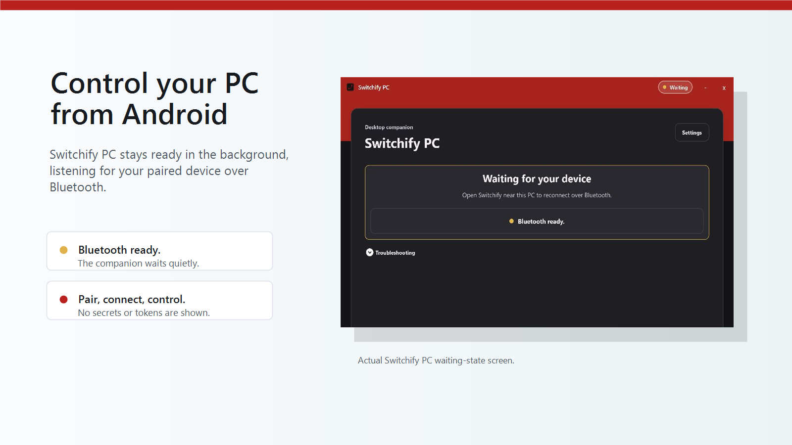

# Switchify PC

Switchify PC is the Windows desktop companion for Switchify Android. It runs in the tray, accepts authenticated Bluetooth commands from paired Android devices, and turns them into mouse, keyboard, text, media, window, and status actions on the PC.



Switchify PC is early-stage Windows-first software. Expect Bluetooth and Windows packaging behavior to be the main supported path for now.

## Download

Download the latest Windows installer from GitHub Releases:

- [Latest Switchify PC release](https://github.com/switchifyapp/switchify-pc/releases/latest)

Install Switchify Android from Google Play:

- [Switchify for Android](https://play.google.com/store/apps/details?id=com.enaboapps.switchify)

The Windows installer is a per-machine installer and should be installed under `C:\Program Files\Switchify PC\` so Windows can honor `uiAccess`.

## Requirements

- Windows 10 or later.
- Bluetooth enabled on the PC.
- Switchify Android installed on a nearby Android device.
- Per-machine install under `C:\Program Files\Switchify PC\` for full `uiAccess` behavior.

## Using Switchify PC

1. Install Switchify PC.
2. Install Switchify Android.
3. Launch Switchify PC and leave it running in the tray.
4. Open Switchify Android near the PC.
5. Approve the pairing request on the PC and confirm the verification code.
6. Use the Android app to control the PC.

If the main window is closed, Switchify PC continues running from the tray. Use the tray menu to reopen it or quit.

## Development

Restore the C# solution:

```powershell
dotnet restore src/SwitchifyPc.sln
```

Build the app:

```powershell
dotnet build src/SwitchifyPc.sln -c Release --no-restore
```

Run tests:

```powershell
dotnet test src/SwitchifyPc.sln -c Release --no-build
```

## Windows packaging

Stage a local Windows x64 package without signing:

```powershell
pwsh scripts/Package-Windows.ps1 -StageOnly -SkipSign
pwsh scripts/Verify-DotnetPackage.ps1
```

Create a local Windows x64 installer:

```powershell
pwsh scripts/Package-Windows.ps1
pwsh scripts/Verify-DotnetPackage.ps1
pwsh scripts/Verify-UpdaterMetadata.ps1
```

Local packaging builds artifacts under `dist`. It does not publish a GitHub release.

## Windows uiAccess packaging

Switchify PC uses `uiAccess="true"` so the installed app can interact with elevated or higher-integrity windows for accessibility and input automation scenarios.

Windows only honors `uiAccess` when all of these are true:

- The app executable manifest has `level="highestAvailable"` and `uiAccess="true"`.
- The executable is Authenticode signed.
- The executable is installed in a secure location such as `C:\Program Files\Switchify PC\`.
- Signing happens after icon and manifest resource embedding.

Development builds can use a local code-signing certificate through the signing environment variables supported by `scripts/WinSigningTools.psm1`. Then package and verify:

```powershell
$env:SWITCHIFY_DEV_CERT_PASSWORD = "<local-password>"
pwsh scripts/Package-Windows.ps1
pwsh scripts/Verify-DotnetPackage.ps1
pwsh scripts/Verify-UpdaterMetadata.ps1
```

Run the generated installer from `dist` and install per-machine. Running from the repo, `dist/win-unpacked`, AppData, or Downloads does not prove that `uiAccess` is active.

Self-signed certificates are for development and testing only. Production users should not be asked to trust a self-signed certificate manually.

## Production signing

Production Windows packages are signed with the Certum SimplySign code-signing certificate through `signtool`.

Required environment variables:

```powershell
$env:SWITCHIFY_SIGNING_MODE = "certum-simplysign"
$env:SWITCHIFY_CERTUM_CERT_THUMBPRINT = "<certum-certificate-thumbprint>"
$env:SWITCHIFY_CERTUM_TIMESTAMP_URL = "http://time.certum.pl"
```

The release workflow expects the Certum certificate to be available in `Cert:\CurrentUser\My` on the Windows signing runner and the SimplySign session to be available before the release job runs.

## Release CI

Only the maintainer should publish releases.

Release builds are published from tags named `vX.Y.Z`, where `X.Y.Z` matches the C# app project `<Version>`.

The release workflow runs on the self-hosted Windows signing runner with the `switchify-signing` label. It:

- restores the C# solution
- builds the C# solution
- runs C# tests
- verifies the Certum signing certificate
- packages the Windows x64 NSIS installer
- verifies updater metadata
- verifies the tag matches the C# app project version
- uploads the installer and update metadata to GitHub Releases

The maintainer can publish a release by pushing an annotated tag:

```powershell
git tag -a vX.Y.Z -m "Release vX.Y.Z"
git push origin vX.Y.Z
```

The workflow can also be dispatched manually by the maintainer with a `tag` input.

## Bluetooth connection expectations

Switchify PC uses Bluetooth for PC control pairing and reconnect. The Android device must be near the PC, Bluetooth must be enabled on both devices, and the first pairing still requires approval on the PC.

Paired devices reconnect over Bluetooth using the existing app-level pairing token and authenticated command flow. Local-network WebSocket control, mDNS discovery, manual IP entry, and QR connection are not part of the product path.

## Security

Bluetooth proximity is not authentication. Pairing approval and authenticated commands remain required, and pairing tokens, auth proofs, and typed text payloads must not be exposed in logs or UI.

Please report vulnerabilities by email to owen@switchifyapp.com instead of opening public issues.

## MVP smoke checklist

Use this checklist after packaging changes and before publishing any installer:

- Signed installer verifies with Authenticode.
- Installer installs under `C:\Program Files\Switchify PC\`.
- App launches from `Switchify PC.exe`.
- Tray menu opens and can show the main window.
- Main window shows Android download QR/link before a device is connected.
- Android download link opens externally in the browser.
- Bluetooth starts and reports a safe status.
- No QR/manual local-network connection UI appears for pairing or control.
- No local IP address or WebSocket address appears in Settings or troubleshooting.
- Pairing approval requests appear and can be accepted or rejected.
- Android can pair with the PC using Bluetooth and approval.
- Paired Android device can disconnect and reconnect without deleting the saved pairing.
- Authenticated ping receives an ack.
- Relative mouse movement works and remains responsive under repeated movement.
- Cursor highlight appears as a green ring, not a square, including over the Start menu.
- Cursor highlight does not steal focus or block clicks.
- Left click works.
- Right-click works.
- Scroll works.
- Text typing works in a focused text field.
- Keyboard shortcut works, for example `Ctrl+C` or `Ctrl+V`.
- Media key command works, for example play/pause or volume up.
- Window control commands work, for example next app and show desktop.
- Settings > Updates can check for updates in packaged builds.
- Downloaded updates show an `Install update` action.
- Disconnect all removes active Bluetooth sessions.
- Quit exits the app and removes the tray icon.

## License

Switchify PC is licensed under the GNU Affero General Public License v3.0 or later. See `LICENSE`.
